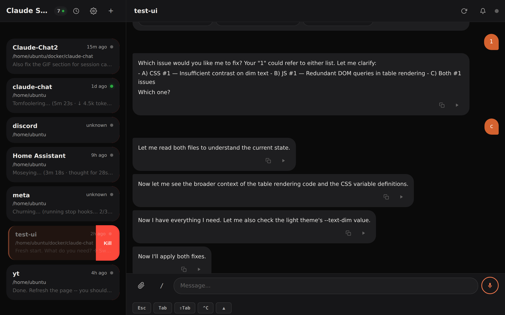
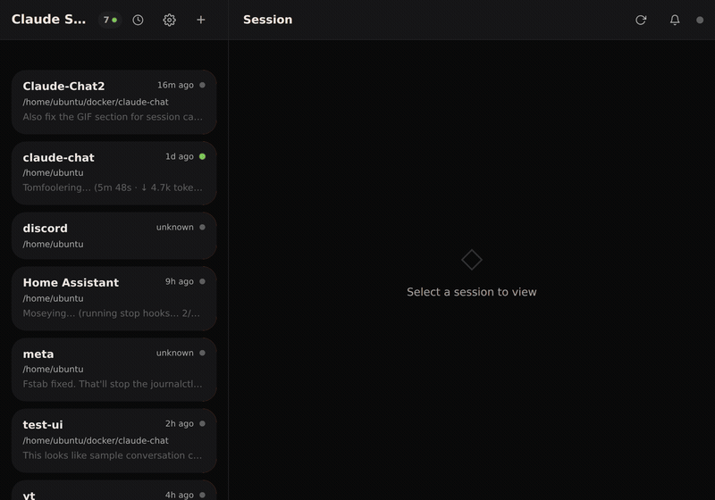
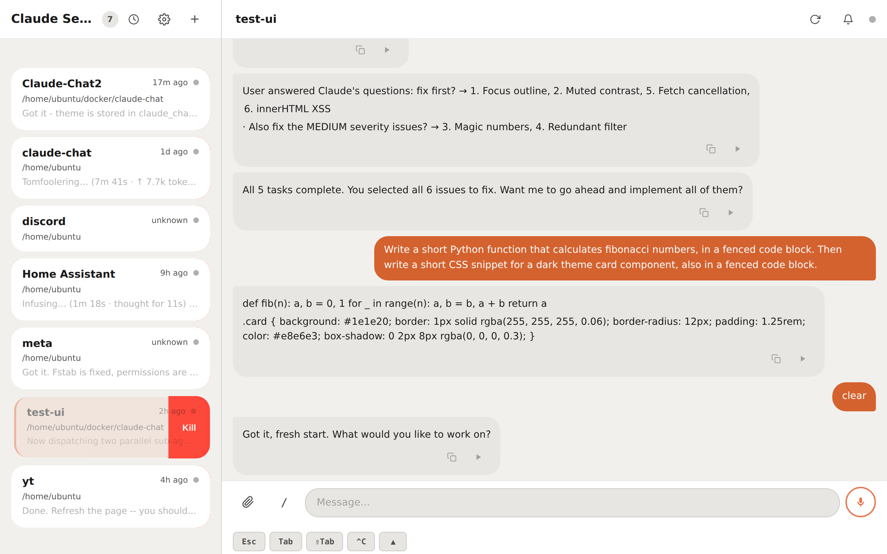
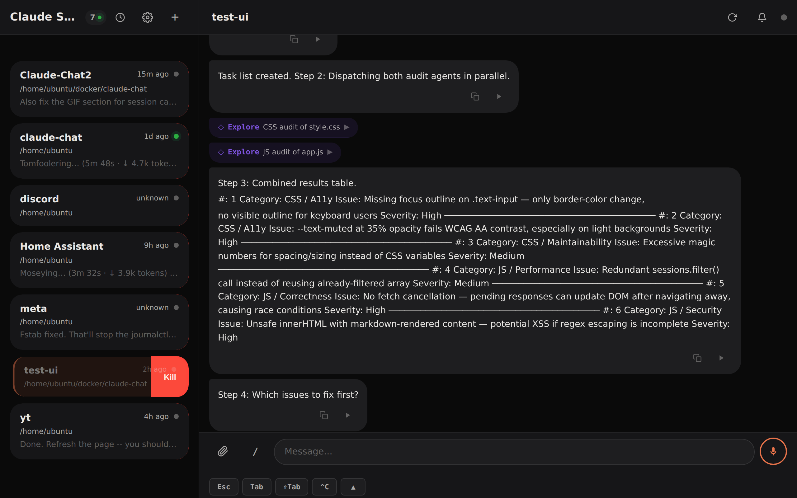
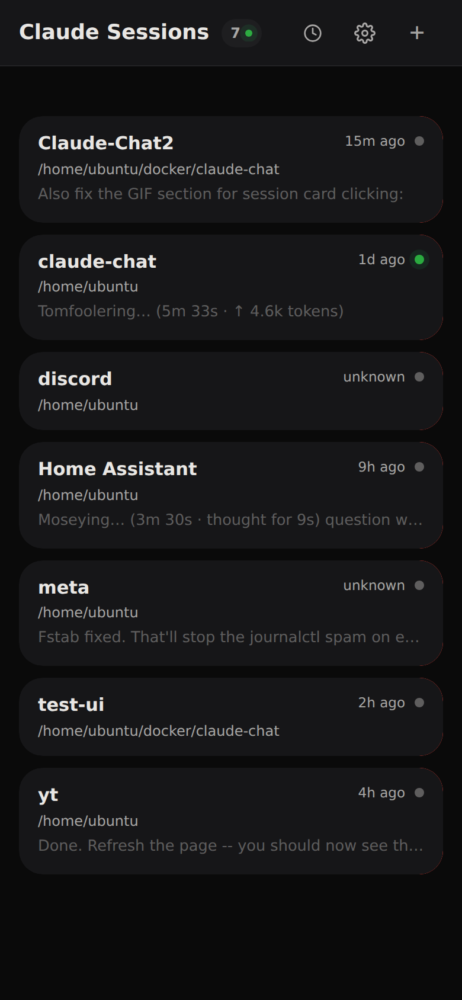
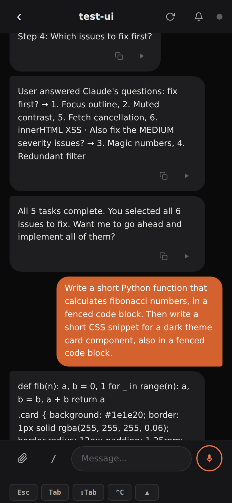

<div align="center">

# Claude Chat

### Your Claude Code sessions deserve a UI.

**A real-time web interface for headless Claude Code sessions running in tmux.**
Voice input. File uploads. Three themes. Zero frameworks. ~6,000 lines of hand-crafted code.

[](https://python.org)
[](https://fastapi.tiangolo.com)
[](LICENSE)
[](Dockerfile)
[](#pwa-support)

<br/>



</div>

---

## The Problem

You spin up Claude Code in a tmux session on a remote server. It's doing incredible work — writing code, running tests, deploying services. But you're stuck SSH'd into a terminal, squinting at raw output, unable to send voice messages or upload files.

**Claude Chat gives your headless Claude Code sessions a proper home.**

It doesn't wrap the Claude API. It doesn't pretend to be Claude. It connects to your *actual running Claude Code processes* and gives them a beautiful, mobile-friendly interface with features the terminal can't offer.

## Demo

<div align="center">

</div>

## Features

### Session Management
- **Live session list** with status indicators (idle / working / waiting for input / dead)
- **Pin sessions** to the top for quick access
- **Session history** — dismissed sessions are archived and restorable
- **Kill, respawn, dismiss** — full lifecycle control from the UI
- **Auto-generated titles** from conversation content via LLM

### Real-Time Chat
- **Sub-second polling** with content-hash change detection (no wasted bandwidth)
- **Smart message parsing** — understands Claude Code's visual markers (tool calls, results, status lines, dividers)
- **20+ tool types recognized** — Bash, Read, Write, Edit, Grep, Glob, Agent, Skill, TaskCreate, and more
- **Tool calls collapsed** into clean cards with expandable results
- **Syntax highlighting** for code blocks
- **Markdown rendering** in both user and assistant messages — numbered lists, bullets, bold, inline code, tables
- **New message pill** with auto-scroll to unread

### Interactive Quick-Reply
- **Numbered options detected** automatically in assistant messages
- **Multi-select** — tap to toggle options, "Send 1, 3, 5" button appears
- Up to 12 options supported per message
- Triggers on questions (`?`), prompts (`:`), or the last assistant message with choices

### Voice Input (Dual Mode)
- **Native Web Speech API** — zero-latency on-device transcription (Chrome, Safari, Edge)
- **Whisper fallback** — when native speech isn't available, records audio and sends to your Whisper STT server
- **Appends, doesn't replace** — voice input adds to existing text in the input box

### Command Palette
- Type `/` to discover built-in commands (`/review`, `/compact`, `/cost`, `/status`...)
- **Auto-discovers custom skills** from `~/.claude/skills/*/SKILL.md`
- 60-second cache to keep things snappy

### File Uploads
- Drop images, PDFs, code files, CSVs — up to 10MB
- Files are stored and referenced by path so Claude can read them
- **Inline image preview** in the chat feed

### Special Keys Toolbar
- `Esc` `Tab` `Shift+Tab` `Ctrl+C` `Up` — sent directly to the tmux session
- Essential for accepting/rejecting suggestions, interrupting, and navigating history

### Desktop Notifications
- Toggle the bell icon to get notified when a session finishes working
- Proxies through ntfy for cross-device support

### PIN Authentication
- Optional — set `PIN_HASH` to enable, omit to run open
- SHA-256 hashed PIN, Bearer token in localStorage
- Protects all `/api/` endpoints

## Themes

Three carefully crafted themes. Dark is the default. OLED for battery life. Light for the sunshine people.

<div align="center">
<table>
<tr>
<td align="center"><strong>Dark</strong></td>
<td align="center"><strong>Light</strong></td>
<td align="center"><strong>OLED</strong></td>
</tr>
<tr>
<td></td>
<td></td>
<td></td>
</tr>
</table>
</div>

## Mobile First

Designed for phones. Scales up to desktops.

<div align="center">
<table>
<tr>
<td align="center"><strong>Session List</strong></td>
<td align="center"><strong>Chat View</strong></td>
</tr>
<tr>
<td></td>
<td></td>
</tr>
</table>
</div>

- PWA-installable — add to home screen, runs standalone
- Safe area padding for notched devices
- Swipe gestures for navigation
- Auto-expanding textarea with special keys toolbar

## Quick Start

### Docker (recommended)

```bash
docker run -d \
  --name claude-chat \
  -p 8800:8800 \
  -v /tmp/tmux-1000:/tmp/tmux-1000 \
  -e PIN_HASH=$(echo -n "yourpin" | sha256sum | cut -d' ' -f1) \
  claude-chat
```

### Docker Compose

```yaml
services:
  claude-chat:
    build: .
    ports:
      - "8800:8800"
    volumes:
      - /tmp/tmux-1000:/tmp/tmux-1000    # tmux socket
      - uploads:/uploads                  # file uploads
    environment:
      - PIN_HASH=your_sha256_hash_here    # optional: omit for no auth
      - WHISPER_URL=http://host.docker.internal:2022  # optional: Whisper STT
    extra_hosts:
      - "host.docker.internal:host-gateway"

volumes:
  uploads:
```

### Build & Run

```bash
git clone https://github.com/youruser/claude-chat.git
cd claude-chat
docker build -t claude-chat .
docker run -d -p 8800:8800 -v /tmp/tmux-1000:/tmp/tmux-1000 claude-chat
```

Then open `http://localhost:8800` and see your Claude Code sessions.

### Prerequisites

- **tmux** sessions running Claude Code (that's it)
- Docker (or Python 3.12 + `pip install fastapi uvicorn httpx python-multipart pyyaml`)

## Architecture

```
┌─────────────────────────────────────────────────────┐
│                    Browser (PWA)                     │
│  ┌───────────────┐  ┌────────────────────────────┐  │
│  │  Session List  │  │      Chat View             │  │
│  │  - status dots │  │  - parsed messages         │  │
│  │  - previews    │  │  - tool call cards         │  │
│  │  - pin/hide    │  │  - voice input             │  │
│  │  - history     │  │  - file uploads            │  │
│  └───────────────┘  │  - command palette          │  │
│                      │  - special keys             │  │
│                      └────────────────────────────┘  │
└──────────────────────┬──────────────────────────────┘
                       │ HTTP polling (1-5s)
                       │ Content-hash diffing
┌──────────────────────┴──────────────────────────────┐
│              FastAPI Backend (app.py)                 │
│  - Session discovery via tmux list-sessions          │
│  - Message parsing (❯ user, ● assistant, ⎿ tool)    │
│  - Whitelist-enforced tmux commands (9 allowed)      │
│  - PIN auth with Bearer tokens                       │
│  - File upload + image serving                       │
│  - Whisper STT proxy                                 │
│  - ntfy notification proxy                           │
│  - LiteLLM title generation                          │
└──────────────────────┬──────────────────────────────┘
                       │ tmux CLI (subprocess)
┌──────────────────────┴──────────────────────────────┐
│                  tmux sessions                       │
│  ┌──────────┐ ┌──────────┐ ┌──────────┐            │
│  │ claude-1 │ │ claude-2 │ │ claude-3 │  ...        │
│  │ (working)│ │  (idle)  │ │  (dead)  │            │
│  └──────────┘ └──────────┘ └──────────┘            │
└─────────────────────────────────────────────────────┘
```

## How It Works

Claude Chat doesn't use the Claude API. It talks to **tmux**.

1. **Discovery** — polls `tmux list-sessions` to find active sessions, checks each pane for running Claude Code processes
2. **Reading** — captures pane output via `tmux capture-pane`, parses visual markers (`❯` = user, `●` = assistant, `⎿` = tool result)
3. **Writing** — sends keystrokes via `tmux send-keys` with the `-l` (literal) flag to prevent injection
4. **Diffing** — hashes captured content and only sends full updates when something changed

### Security

- **tmux command whitelist** — only 9 commands allowed (`list-sessions`, `send-keys`, `capture-pane`...)
- **Session name regex** — `^[a-zA-Z0-9_][a-zA-Z0-9_-]*$` prevents tmux parsing attacks
- **Literal send-keys** — `-l` flag prevents shell metacharacter injection
- **Path traversal protection** — `os.path.realpath()` + allowlist on session creation
- **XSS prevention** — HTML entity escaping before markdown rendering, never raw `.innerHTML`
- **No cookies** — Bearer tokens only, immune to CSRF

## Configuration

| Variable | Default | Description |
|----------|---------|-------------|
| `PIN_HASH` | *(empty = no auth)* | SHA-256 hex digest of your PIN |
| `WHISPER_URL` | `http://host.docker.internal:2022` | Whisper STT server URL |
| `LITELLM_URL` | `http://host.docker.internal:4000/v1/...` | LLM API for auto-titles |
| `TMUX_SOCKET` | `/tmp/tmux-1000/default` | tmux socket path |
| `UPLOAD_DIR` | `/uploads` | File upload storage directory |
| `CLAUDE_DATA_DIR` | `/claude-data` | Claude metadata directory |

## API

Full REST API for programmatic access:

| Method | Endpoint | Description |
|--------|----------|-------------|
| `GET` | `/api/sessions` | List all sessions with metadata |
| `GET` | `/api/sessions/{name}` | Full session with parsed messages |
| `POST` | `/api/sessions/{name}/send` | Send text to session |
| `POST` | `/api/sessions/{name}/key` | Send special key (Esc, Tab, Ctrl+C...) |
| `POST` | `/api/sessions/{name}/kill` | Gracefully stop Claude |
| `POST` | `/api/sessions/{name}/respawn` | Restart Claude in dead session |
| `DELETE` | `/api/sessions/{name}` | Kill tmux session entirely |
| `GET` | `/api/sessions/{name}/poll` | Check for changes (content-hash) |
| `POST` | `/api/transcribe` | Proxy audio to Whisper STT |
| `POST` | `/api/upload/{name}` | Upload file to session |
| `GET` | `/api/commands` | List available commands + skills |
| `GET` | `/api/history` | Dismissed session archive |
| `GET` | `/health` | System health check |

## Tech Stack

| Layer | Technology | Lines |
|-------|-----------|-------|
| Backend | Python 3.12, FastAPI, Uvicorn | ~1,070 |
| Frontend | Vanilla JavaScript (no frameworks) | ~3,020 |
| Styling | Hand-written CSS (custom properties, no preprocessor) | ~2,210 |
| Markup | Semantic HTML5 | ~120 |
| Runtime | Docker (python:3.12-slim + tmux) | 8 |
| **Total** | | **~6,420** |

No React. No Vue. No Svelte. No Tailwind. No webpack. No npm. No node_modules.

Just a FastAPI server, vanilla JS, and hand-written CSS. The entire app ships in **4 files**.

## PWA Support

Claude Chat is a full Progressive Web App:

- **Installable** — "Add to Home Screen" on iOS/Android, installs as app on desktop
- **Offline shell** — service worker caches static assets, shows cached UI even when server is unreachable
- **Network-first API** — always fetches fresh data, falls back to cache
- **Auto-updates** — service worker version bump triggers cache refresh

## Project Structure

```
claude-chat/
├── app.py              # FastAPI backend — routing, tmux integration, auth, parsing
├── Dockerfile          # 8-line Docker build
├── static/
│   ├── index.html      # Single-page app shell (auth screen, session list, chat view)
│   ├── js/app.js       # All frontend logic — polling, voice, messaging, themes
│   ├── css/style.css   # Complete design system — 3 themes, responsive, animations
│   ├── sw.js           # Service worker — caching strategies, version management
│   └── icon.svg        # App icon (SVG for any resolution)
└── docs/
    └── images/         # Screenshots for this README
```

## Contributing

This is a personal project built for a specific workflow (monitoring headless Claude Code sessions on a homelab server). That said, if you find it useful:

1. **Fork it** — adapt it to your setup
2. **Issues** — bug reports welcome
3. **PRs** — keep them focused, match the existing style (vanilla JS, no frameworks, no build tools)

## Why Not Just Use the Terminal?

You could. But then you can't:

- Talk to Claude with your voice while cooking
- Check on 7 concurrent sessions from your phone
- Upload a screenshot by tapping a button
- Get a notification when your 3-hour refactor finishes
- Hand your phone to someone and say "ask Claude anything"
- See your sessions with pretty colors instead of raw terminal output

## License

MIT — do whatever you want with it.

---

<div align="center">

*Built for developers who run Claude Code headless and want their eyes back.*

**Claude Chat** is not affiliated with Anthropic. It connects to Claude Code sessions running in tmux.

</div>
